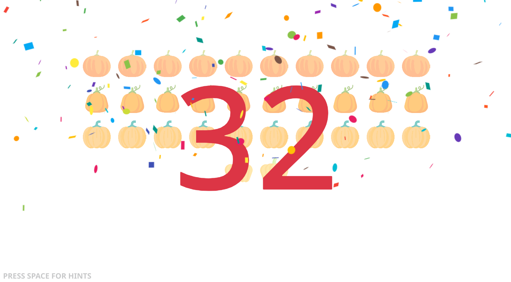
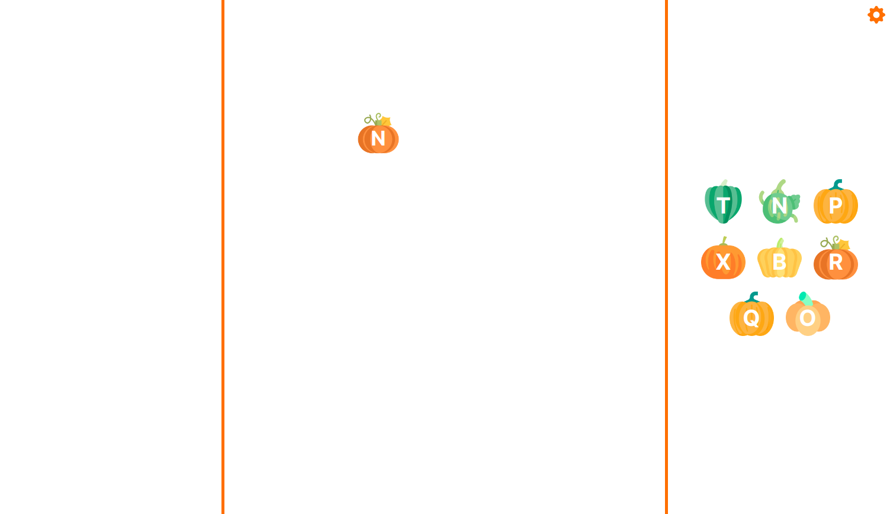
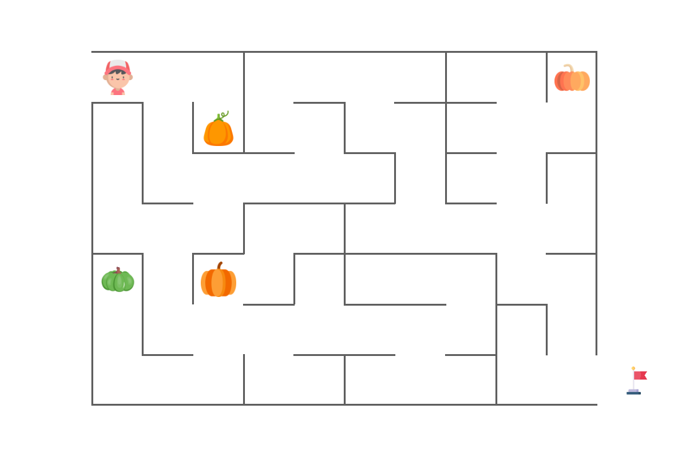

# Pumpkin Games

Some simple games I made to help my kids practice letters and numbers 😄

Play here: 👉 [**jichu4n.github.io/pumpkin-games**](https://jichu4n.github.io/pumpkin-games/) 👈

Note that the games require a physical keyboard, so you'll need to use a laptop / desktop computer.

## Pumpking Counting Game

Practice counting from 1 - 50!

How to play:

- Count the number of pumpkins on screen, and type that number on the keyboard.
- If you type the correct number, you win!
- If you need a bit of help, press space to show hints on top of the pumpkins.

## Pumpkin Letter Game

Practice the alphabet!

How to play:

- When you see a pumpkin appear, press the corresponding letter on the keyboard before it disappears. This "captures" the pumpkin and adds it to your shelf, displayed on the right.
- When you've captured 12 pumpkins, you win! You can press space to restart the game.
- Click the icon in the top right to change game settings like speed and uppercase / lowercase letters.

## Pumpkin Maze Game

Practice directions on a 2D surface!

How to play:

- Use arrow keys on the keyboard to navigate the maze.
- To win, you must capture all the pumpkins in the maze and then exit through the bottom right corner.
- Press space to restart the game once won / lost.
- Click the gear icon in the top right to change game settings like the avatar, maze dimensions, and number of pumpkins.
